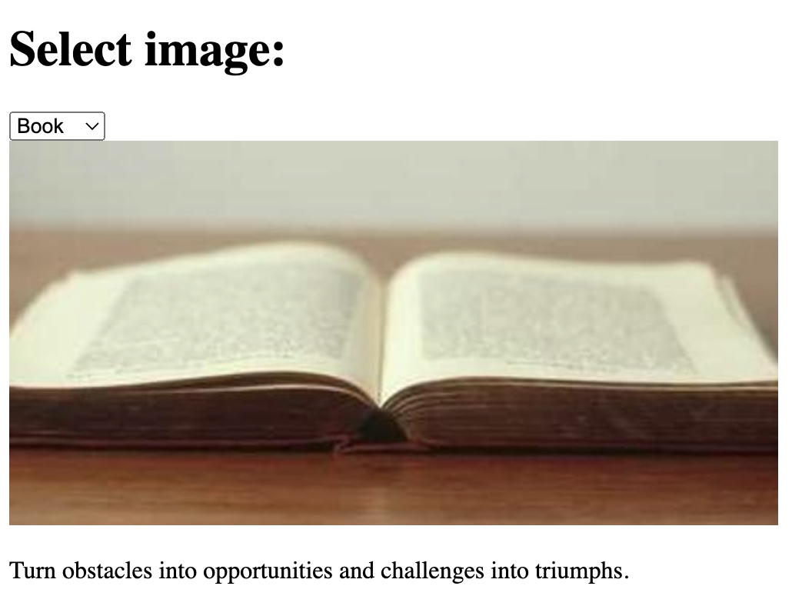

# dev-photo-gallery
Photo gallery

## Expected output

## Current link
[Page with error](https://anandrktm.github.io/dev-photo-gallery/) 

## Instructions
1. Find the errors
2. Fix the error
3. Share your solution on your repository's [github page](https://pages.github.com/)
4. Raise a PR with the fix.

<!-- Errors found and Fixed -->
1. The 
 with id="container" should be inside the <body> tag, not the <head> tag. Moved it accordingly.

2. There's a semicolon at the end of img_bird URL in the JavaScript code. Removed it to have a valid URL

3. used quote[Math.floor(Math.random() * 4)] to access a random quote, but since the quote array has five elements, we should use quote[Math.floor(Math.random() * quote.length)] to make it dynamic and work with any number of quotes.

4. Replaced the img_layout to img_book because the dropdown selected for that was book and the image that was loading was layout image . 

5. the async keyword is not necessary in this context. The window.onload event handler is not using any asynchronous operations that require the async keyword.

6.Updated image URLs for 600x400 layout, ensuring uniform dimensions for book, layout, and bird options in the photo gallery.

Thanks for giving me this opporrtunity to do something like this . As per my knowledge I have done the above corrections .Also I wanted to ask about that favicon.ico file because that was empty and I haven't seen anything needed there in index.html file regrading favicon.ico.